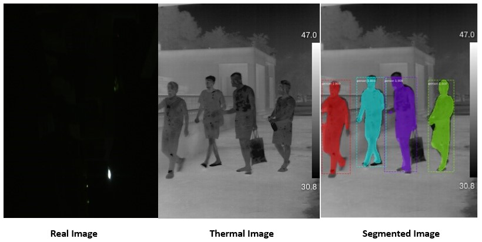

# Real-time Instance Segmentation of Thermal Images and Videos for Intrusion Detection Using Mask R-CNN

This is an implementation of Facebook's Mask RCNN instance segmentation model. The model is funetuned for thermal imaging tasks and gets an IOU score of 0.96. This beats the state-of-the-art mask rcnn model for this specific use case. It's based on Feature Pyramid Network (FPN) and a ResNet101 backbone.

I had the opportunity to conduct this work during my summer research internship at IIIT Allahabad from May 2019 to July 2019. Under the guidance of Prof. Satish Kumar Singh and mentorship of Dr. Albert Mundu, I was able to successfully complete this project.

### Dataset
The thermal image/video dataset(positive as well as negative images/videos) was generated from scratch, using the thermal camera(property of IIIT Allahabad). The collection, cleaning, annotation as well as other steps involved in creating the dataset was also carried out by me.   

### Example

The repository includes:
* Source code of Mask R-CNN built on FPN and ResNet101.
* Transfer Learning code on Thermal Images
* Finetuned weights for Thermal Images
* Jupyter notebooks to visualize the detection pipeline at every step

## See the Results
* [segmentation_notebook](segmentation_notebook.ipynb) Is the easiest way to start. It shows how to use finetuned model (pre-trained on MS COCO) to segment objects on thermal images.

## Reference
The work is inspired from the Facebook's 2018 paper [Mask R-CNN](https://arxiv.org/abs/1703.06870).

